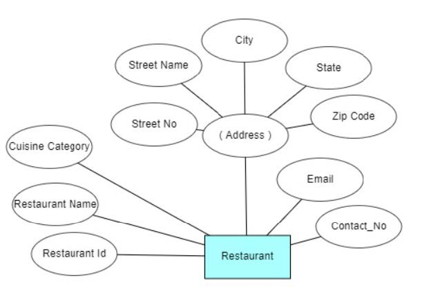

# Database Design - Doordash

## Entities
### User/Customer
<p style="background-color:white; display: inline-block;">
  
</p>

### Restaurant
<p style="background-color:white; display: inline-block;">
  
</p>

### Food
<p style="background-color:white; display: inline-block;">
  
</p>

### Order
<p style="background-color:white; display: inline-block;">
  
</p>

### Payment
<p style="background-color:white; display: inline-block;">
  
</p>

### Transactions
<p style="background-color:white; display: inline-block;">
  
</p>

### DoorDasher
<p style="background-color:white; display: inline-block;">
  
</p>

### Vehicle
<p style="background-color:white; display: inline-block;">
  
</p>


## ER Diagram
<p style="background-color:white; display: inline-block;">
  
</p>

## Before Normalization

<p style="background-color:white; display: inline-block;">
  
</p>

## After Normalization

<p style="background-color:white; display: inline-block;">
  
</p>

## Database Creation

```sql
CREATE TABLE customer (
    customer_id   INTEGER     NOT NULL,
    email         VARCHAR(50),
    passcode      VARCHAR(20) NOT NULL,
    first_name    VARCHAR(30) NOT NULL,
    last_name     VARCHAR(30),
    country_code  NUMBER(2) DEFAULT 0,
    mobile_number NUMBER(10) NOT NULL,
    dashpass      VARCHAR(10) DEFAULT 'InActive',
    PRIMARY KEY (customer_id)
);

CREATE TABLE zipcode (
    zipcode   NUMBER(6),
    city      VARCHAR(20) NOT NULL,
    state_name VARCHAR(20),
    PRIMARY KEY (zipcode)
);

CREATE TABLE address (
    address_id   INTEGER,
    street_no    INTEGER,
    street_name  VARCHAR(50) NOT NULL,
    zipcode      NUMBER(6) NOT NULL,
    customer_id  INTEGER,
    PRIMARY KEY (address_id),
    FOREIGN KEY (zipcode) REFERENCES zipcode (zipcode) ON DELETE CASCADE,
    FOREIGN KEY (customer_id) REFERENCES customer (customer_id) ON DELETE CASCADE
);

CREATE TABLE restaurant (
    restaurant_id   INTEGER,
    restaurant_name VARCHAR(30) NOT NULL,
    cuisine_category VARCHAR(20),
    email           VARCHAR(50),
    contact_no      NUMBER(10) NOT NULL,
    rating          NUMBER(3, 2),
    PRIMARY KEY (restaurant_id)
);

CREATE TABLE reviews (
    restaurant_id      INTEGER,
    customer_id        INTEGER,
    review_description VARCHAR(500),
    rating             NUMBER(3, 2) NOT NULL,
    review_date        DATE,
    PRIMARY KEY (restaurant_id, customer_id),
    FOREIGN KEY (restaurant_id) REFERENCES restaurant (restaurant_id) ON DELETE CASCADE,
    FOREIGN KEY (customer_id) REFERENCES customer (customer_id) ON DELETE CASCADE
);

CREATE TABLE image (
    image_reference_id INTEGER,
    image_location     VARCHAR(100),
    PRIMARY KEY (image_reference_id)
);

CREATE TABLE food (
    food_id             INTEGER,
    food_name           VARCHAR(20) NOT NULL,
    food_description    VARCHAR(100),
    category            VARCHAR(20),
    options             VARCHAR(10),
    price               NUMBER(8, 2) NOT NULL,
    calorie             INTEGER,
    image_reference_id  INTEGER,
    restaurant_id       INTEGER,
    PRIMARY KEY (food_id),
    FOREIGN KEY (restaurant_id) REFERENCES restaurant (restaurant_id) ON DELETE CASCADE,
    FOREIGN KEY (image_reference_id) REFERENCES image (image_reference_id) ON DELETE CASCADE
);

CREATE TABLE order_details (
    order_id             INTEGER,
    order_date           DATE      NOT NULL,
    order_time           TIMESTAMP NOT NULL,
    order_contact_number NUMBER(10) NOT NULL,
    price                NUMBER(10, 2) NOT NULL,
    tax                  NUMBER(10, 3) DEFAULT 8.025,
    promo_code           VARCHAR(30) DEFAULT NULL,
    PRIMARY KEY (order_id)
);

CREATE TABLE order_pickup (
    order_id    INTEGER,
    customer_id INTEGER,
    PRIMARY KEY (order_id, customer_id),
    FOREIGN KEY (customer_id) REFERENCES customer (customer_id) ON DELETE CASCADE,
    FOREIGN KEY (order_id) REFERENCES order_details (order_id) ON DELETE CASCADE
);

CREATE TABLE door_dasher (
    ssn               CHAR(9),
    dasher_name       VARCHAR(40) NOT NULL,
    driving_license_id INTEGER     NOT NULL,
    email             VARCHAR(50),
    contact_number    NUMBER(10) NOT NULL,
    rating            NUMBER(3, 2),
    orders_fulfilled  INTEGER DEFAULT 0,
    bank_account_number NUMBER(20) NOT NULL,
    PRIMARY KEY (ssn)
);

CREATE TABLE order_delivery (
    order_id            INTEGER,
    delivery_fee        NUMBER(6, 2),
    delivery_status     NUMBER(1) DEFAULT 0,
    delivery_tip        NUMBER(6, 2),
    delivery_address_id INTEGER NOT NULL,
    door_dasher_ssn      CHAR(9),
    PRIMARY KEY (order_id),
    FOREIGN KEY (delivery_address_id) REFERENCES address (address_id),
    FOREIGN KEY (order_id) REFERENCES order_details (order_id) ON DELETE CASCADE,
    FOREIGN KEY (door_dasher_ssn) REFERENCES door_dasher (ssn) ON DELETE CASCADE
);

CREATE TABLE payment (
    payment_id  INTEGER,
    customer_id INTEGER,
    PRIMARY KEY (payment_id),
    FOREIGN KEY (customer_id) REFERENCES customer (customer_id) ON DELETE CASCADE
);

CREATE TABLE card_details (
    card_no      NUMBER(16),
    cvc          NUMBER(3) NOT NULL,
    expiry_month VARCHAR(3) NOT NULL,
    expiry_year  NUMBER(4) NOT NULL,
    PRIMARY KEY (card_no)
);

CREATE TABLE card (
    payment_id INTEGER,
    card_no    NUMBER(16) NOT NULL,
    PRIMARY KEY (payment_id),
    FOREIGN KEY (payment_id) REFERENCES payment (payment_id) ON DELETE CASCADE,
    FOREIGN KEY (card_no) REFERENCES card_details (card_no) ON DELETE CASCADE
);

CREATE TABLE venmo (
    payment_id INTEGER,
    venmo_id   VARCHAR(30) NOT NULL,
    PRIMARY KEY (payment_id),
    FOREIGN KEY (payment_id) REFERENCES payment (payment_id) ON DELETE CASCADE
);

CREATE TABLE paypal (
    payment_id INTEGER,
    paypal_id  VARCHAR(30) NOT NULL,
    PRIMARY KEY (payment_id),
    FOREIGN KEY (payment_id) REFERENCES payment (payment_id) ON DELETE CASCADE
);

CREATE TABLE transactions (
    transaction_id   INTEGER,
    transaction_status NUMBER(1) NOT NULL,
    transaction_date DATE,
    transaction_time TIMESTAMP,
    order_id         INTEGER,
    payment_id       INTEGER,
    PRIMARY KEY (transaction_id),
    FOREIGN KEY (payment_id) REFERENCES payment (payment_id) ON DELETE CASCADE,
    FOREIGN KEY (order_id) REFERENCES order_details (order_id) ON DELETE CASCADE
);

CREATE TABLE offer (
    offer_id            INTEGER,
    discount_amount     NUMBER(4),
    discount_percentage NUMBER(3) DEFAULT 0.000,
    PRIMARY KEY (offer_id)
);

CREATE TABLE vehicle (
    vehicle_plate_no NUMBER(4),
    state_code       VARCHAR(5) NOT NULL,
    dasher_ssn       CHAR(9),
    vehicle_type     VARCHAR(10) DEFAULT 'Car',
    PRIMARY KEY (vehicle_plate_no),
    FOREIGN KEY (dasher_ssn) REFERENCES door_dasher (ssn) ON DELETE CASCADE
);

CREATE TABLE food_order (
    food_id INTEGER,
    order_id INTEGER,
    PRIMARY KEY (food_id, order_id),
    FOREIGN KEY (food_id) REFERENCES food (food_id) ON DELETE CASCADE,
    FOREIGN KEY (order_id) REFERENCES order_details (order_id) ON DELETE CASCADE
);

-- In case you need to start over
DROP TABLE IF EXISTS food_order;
DROP TABLE IF EXISTS vehicle;
DROP TABLE IF EXISTS offer;
DROP TABLE IF EXISTS transactions;
DROP TABLE IF EXISTS paypal;
DROP TABLE IF EXISTS venmo;
DROP TABLE IF EXISTS card;
DROP TABLE IF EXISTS card_details;
DROP TABLE IF EXISTS payment;
DROP TABLE IF EXISTS order_delivery;
DROP TABLE IF EXISTS door_dasher;
DROP TABLE IF EXISTS order_pickup;
DROP TABLE IF EXISTS order_details;
DROP TABLE IF EXISTS food;
DROP TABLE IF EXISTS image;
DROP TABLE IF EXISTS reviews;
DROP TABLE IF EXISTS restaurant;
DROP TABLE IF EXISTS address;
DROP TABLE IF EXISTS zipcode;
DROP TABLE IF EXISTS customer;

```

## Stored Procedures and Triggers

```sql
-- Trigger to update the restaurant overall rating when review gets modified or added
CREATE OR REPLACE TRIGGER update_restaurant_rating
AFTER DELETE OR INSERT OR UPDATE OF RATING
ON REVIEWS
FOR EACH ROW
DECLARE
    no_of_ratings NUMBER;
    total_rating NUMBER;
    new_rating NUMBER;
BEGIN
    -- assume that RATING is non-null field
    SELECT COUNT(*) INTO no_of_ratings
    FROM REVIEWS RW
    WHERE RW.RESTAURANTID = :OLD.RESTAURANTID;
    
    SELECT SUM(RATING) INTO total_rating
    FROM REVIEWS RW
    WHERE RW.RESTAURANTID = :OLD.RESTAURANTID;
    
    new_rating := (total_rating / no_of_ratings);
    
    UPDATE RESTAURANT
    SET rating = new_rating
    WHERE RESTAURANTID = :OLD.RESTAURANTID;
END;

-- Trigger to update the restaurant overall rating when review gets modified or added using all conditions
CREATE OR REPLACE TRIGGER update_restaurant_rating_v2
AFTER DELETE OR INSERT OR UPDATE OF RATING
ON REVIEWS
FOR EACH ROW
DECLARE
    no_of_ratings NUMBER;
    rating_diff NUMBER;
    curr_rating NUMBER;
    updated_rating NUMBER;
BEGIN
    -- assume that RATING is non-null field
    SELECT COUNT(*) INTO no_of_ratings
    FROM REVIEWS RW
    WHERE RW.RESTAURANTID = :OLD.RESTAURANTID;
    
    SELECT RATING INTO curr_rating
    FROM RESTAURANT
    WHERE RESTAURANTID = :OLD.RESTAURANTID;
    
    IF DELETING THEN
        updated_rating := (curr_rating * (no_of_ratings + 1) - :OLD.rating) / no_of_ratings;
    END IF;
    
    IF INSERTING THEN
        updated_rating := (curr_rating * (no_of_ratings - 1) + :NEW.rating) / no_of_ratings;
    END IF;
    
    IF UPDATING THEN
        rating_diff := :NEW.RATING - :OLD.RATING;
        updated_rating := (curr_rating * (no_of_ratings) + rating_diff) / no_of_ratings;
    END IF;
    
    UPDATE RESTAURANT
    SET rating = updated_rating
    WHERE RESTAURANTID = :OLD.RESTAURANTID;
END;

-- Trigger to update the fulfilled orders by a door dasher whenever an order is delivered
CREATE OR REPLACE TRIGGER update_fulfilled_orders
AFTER UPDATE OF DeliveryStatus ON ORDERDELIVERY
FOR EACH ROW
DECLARE
    FULFILLED NUMBER;
BEGIN
    FULFILLED := 1;
    
    IF UPDATING AND :new.DeliveryStatus = FULFILLED THEN
        UPDATE DoorDasher DD
        SET OrdersFulfilled = OrdersFulfilled + 1
        WHERE DD.SSN = :new.DoorDasherSSN;
    END IF;
END;

-- Increasing the food price by a percentage amount
CREATE OR REPLACE PROCEDURE increase_food_price_by_percent(
    rest_id IN RESTAURANT.RESTAURANTID%TYPE,
    percentage IN NUMBER
) AS
    thisFood FOOD%ROWTYPE;
    CURSOR FoodCur IS
        SELECT F.*
        FROM RESTAURANT R, FOOD F
        WHERE R.RESTAURANTID = rest_id
        AND R.RESTAURANTID = F.RESTAURANTID
        FOR UPDATE;
BEGIN
    OPEN FoodCur;
    
    LOOP
        FETCH FoodCur INTO thisFood;
        EXIT WHEN FoodCur%NOTFOUND;
        
        UPDATE FOOD
        SET PRICE = PRICE * (1 + percentage / 100)
        WHERE FOODID = thisFood.FOODID;
        
        dbms_output.put_line(thisFood.FOODNAME || '_current_price_is_' || thisFood.PRICE);
    END LOOP;
    
    CLOSE FoodCur;
END;

-- Finding the Loyal Customers who placed at least N orders
CREATE TABLE LoyalCustomers
(
    CUSTOMERID   NUMBER,
    ORDERS_COUNT NUMBER
);


CREATE OR REPLACE PROCEDURE find_customers_placed_at_least_n_orders(no_of_orders IN NUMBER)
AS
    CURSOR CustomerCur IS
        SELECT O.CUSTOMERID AS CID, COUNT(*) AS ORDERS_COUNT
        FROM CUSTOMER C, ORDERPICKUP O
        WHERE C.CUSTOMERID = O.CUSTOMERID
        GROUP BY O.CUSTOMERID;
    thisCustomer CustomerCur%ROWTYPE;
    orders_count NUMBER;
BEGIN
    DELETE FROM LoyalCustomers;
    
    OPEN CustomerCur;
    
    LOOP
        FETCH CustomerCur INTO thisCustomer;
        EXIT WHEN CustomerCur%NOTFOUND;
        
        orders_count := thisCustomer.ORDERS_COUNT;
        
        IF orders_count >= no_of_orders THEN
            INSERT INTO LoyalCustomers
            VALUES (thisCustomer.CID, thisCustomer.ORDERS_COUNT);
            
            dbms_output.put_line(thisCustomer.CID || '_has_placed_' || thisCustomer.ORDERS_COUNT || '_orders');
        END IF;
    END LOOP;
    
    CLOSE CustomerCur;
END;

-- In case you need to start over
DROP TRIGGER update_restaurant_rating;
DROP TRIGGER update_restaurant_rating_v2;
DROP TRIGGER update_fulfilled_orders;
DROP PROCEDURE increase_food_price_by_percent;
DROP TABLE LoyalCustomers;
DROP PROCEDURE find_customers_placed_at_least_n_orders; 
```